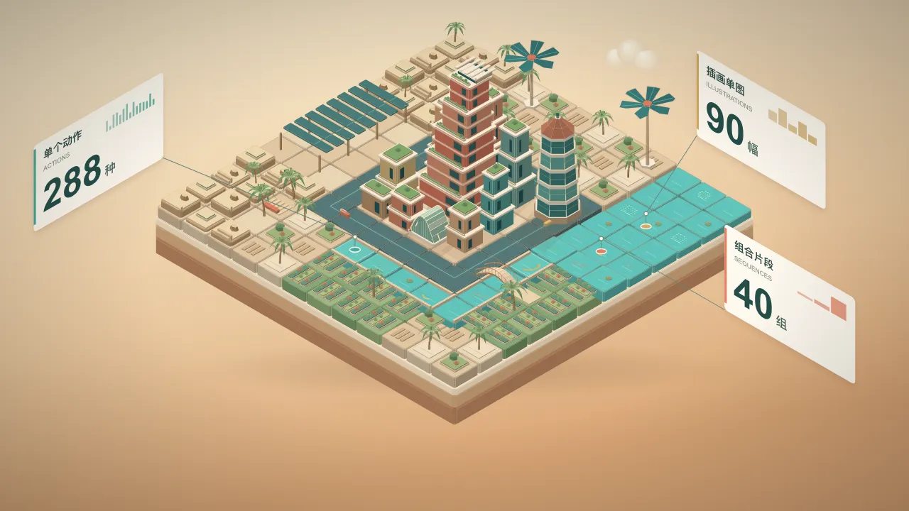
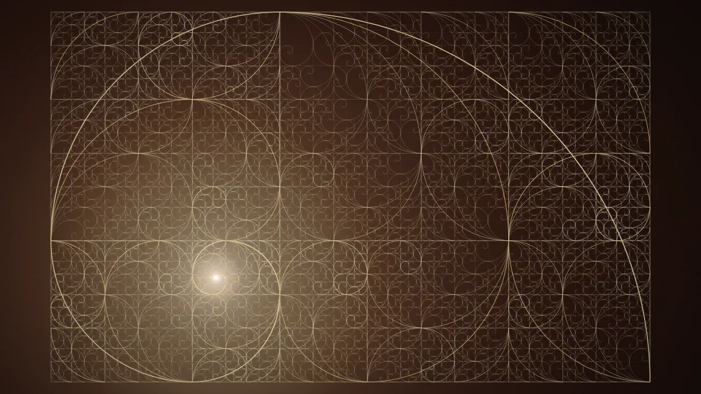
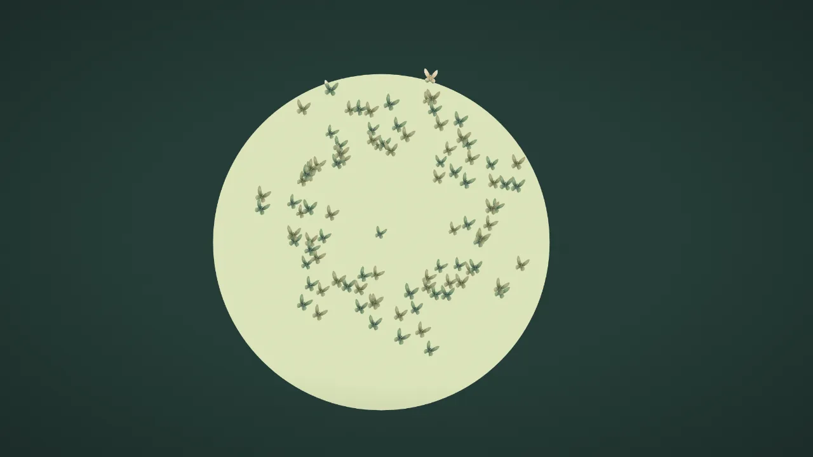

# Wise Motion

理解动作需求，拆解并匹配参考，交付现有源码与接入说明。字幕、分镜、配色和整片组合由调用方的 AI 自行设计；文字动效、转场、插画和组合均可按需取用。

<!-- catalog-counts:start -->
目录有 288 个单个动作、90 个插画单图、40 个组合片段，共 418 项；数量由目录定义自动生成，详见 [目录统计](CATALOG-STATS.md)。
<!-- catalog-counts:end -->

## 精选组合

以下关键帧直接取自现有源码的渲染结果。每个组合都包含连续的动作衔接；点击图片查看动作说明与源码入口，完整播放请在本地打开 [动效目录](catalog/index.html)。

<table>
  <tr>
    <td width="50%" valign="top">
      <a href="references/effects/motion-oasis-sequence.md"></a>
      <br><strong>地块铺展与动效绿洲</strong>
      <br>地砖逐圈翻开 → 楼群与植被长出 → 水面换图、数据卡展开。
      <br><sub>关键帧 3.20 秒 · 全长 4.95 秒</sub>
    </td>
    <td width="50%" valign="top">
      <a href="references/effects/metal-impact-type-sequence.md"></a>
      <br><strong>金属弹开汇聚成字</strong>
      <br>单球落地分裂 → 六色粒子爆散回收 → 汇成金属字面并扫光。
      <br><sub>关键帧 3.70 秒 · 全长 5.30 秒</sub>
    </td>
  </tr>
  <tr>
    <td width="50%" valign="top">
      <a href="references/effects/glass-interface-sequence.md"></a>
      <br><strong>玻璃卡片显现折射</strong>
      <br>六张空间卡片侧转展开 → 音乐、天气与控制中心接续 → 凸泡折射文字。
      <br><sub>关键帧 3.40 秒 · 全长 7.20 秒</sub>
    </td>
    <td width="50%" valign="top">
      <a href="references/effects/point-domain-flow-sequence.md"></a>
      <br><strong>黄金矩形递归生长</strong>
      <br>网格建立并推近 → 字符雨幕与铁花交接 → 黄金矩形递归长满画面。
      <br><sub>关键帧 20.40 秒 · 全长约 21.13 秒</sub>
    </td>
  </tr>
  <tr>
    <td width="50%" valign="top">
      <a href="references/effects/seed-bloom-brand-sequence.md"></a>
      <br><strong>生长化蝶与光形字标</strong>
      <br>种子长成蒲公英 → 炸开旋转化蝶、汇成太阳 → 光束回弹接字标。
      <br><sub>关键帧 2.80 秒 · 全长 8.20 秒</sub>
    </td>
    <td width="50%" valign="top">
      <a href="references/effects/civilization-growth-sequence.md"></a>
      <br><strong>薪火生长与文明聚字</strong>
      <br>草楷火字变换 → 种子、植物与花依次生长 → 文明群像散成粒子聚字。
      <br><sub>关键帧 14.20 秒 · 全长 18.60 秒</sub>
    </td>
  </tr>
</table>

## 浏览与使用

直接打开 [动效目录](catalog/index.html)，无需安装依赖或启动服务器。搜索或按分类选择条目，预览、调整参数，再复制提示词或源码。


在工具中明确选择 **Wise Motion**，例如：

```text
$wise-motion 找两排卡片反向持续滚动的参考，不要停顿，导出源码到我的工程。
$wise-motion 找“标题先出现、卡片依次展开、最后转场”的参考，分别说明覆盖与缺口。
```

全局入口直接链接到技能实际源码：共享入口 `~/.agents/skills/wise-motion`，Codex 入口 `~/.codex/skills/wise-motion`，ZCode 入口 `~/.zcode/skills/wise-motion`。保持仅手动调用；已有入口先核对指向。

## 检索与源码导出

以下用 `<技能目录>` 表示安装入口解析后的实际目录，可从任意工作目录运行。检索、查看、导出只需 Node.js；版本要求见 [package.json](package.json)。

```sh
node "<技能目录>/scripts/match.mjs" "卡片依次上移显现，落位后保留，不要弹跳"
node "<技能目录>/scripts/show.mjs" stagger-in
node "<技能目录>/scripts/export.mjs" stagger-in --out-dir "/目标工程/卡片动作"
```

`show` 默认提供简短接入信息，加 `--details` 查看动作阶段与内容限制。`export` 支持 `--variant <样式编号>`，与目录“复制源码”共用生成逻辑；可写入现有目录，任一目标文件已存在时整批停止，不覆盖文件。

已有独立工程的条目导出全部工程文件；普通条目导出组件接入示例和说明，运行前需安装共享组件包并准备素材。依赖不会自动安装，源码写入文件后返回绝对路径。见 [快速上手](references/quickstart.md) 和 [组件说明](REMOTION.md)。

## 播放与渲染

现有播放器、声音、渲染能力继续保留。需要导出单个动效视频时，在技能目录准备依赖后执行：

```sh
npm ci
npm run build
WISE_MOTION_RENDER_DIR="/目标工程/renders" npm run render -- stagger-in stagger-in.mp4
```

视频渲染使用 Remotion 临时服务；本地目录可直接打开。文件名或绝对输出路径必须位于指定产物目录内。

维护目录后运行 `npm run check`、`python3 scripts/verify_project_skills.py` 及受影响测试。`npm test` 还包含历史迁移检查，需本地私有档案。技术核对见 [验证矩阵](references/validation-matrix.md)，人工播放见 [验收步骤](tests/manual.md)，目录维护见 [维护说明](references/catalog-maintenance.md)。

## 许可

自有技能与源码使用 **AGPLv3**；第三方代码、字体和素材保留各自许可与署名。使用及分发前查阅 [版权与来源说明](NOTICE.md) 和 [完整许可](LICENSE)。
